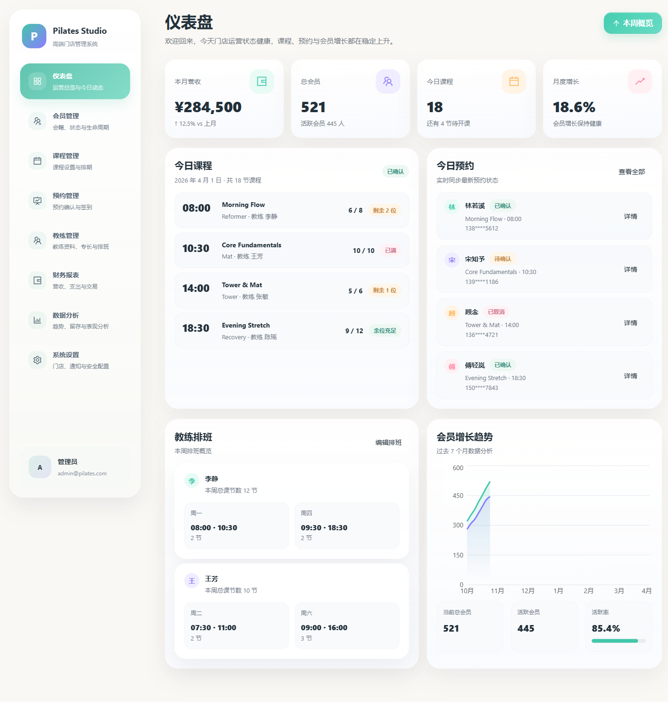
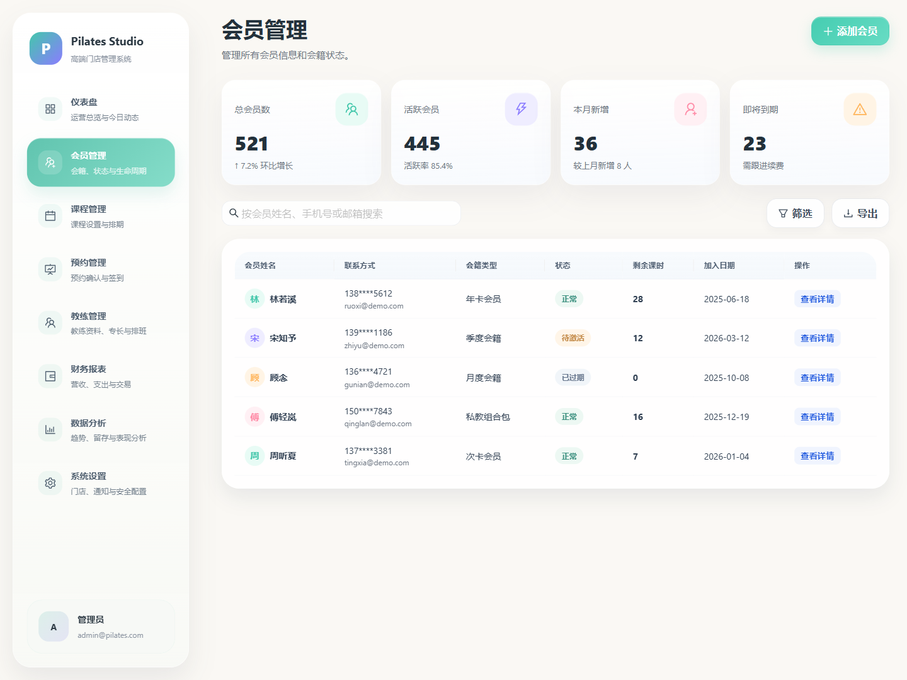
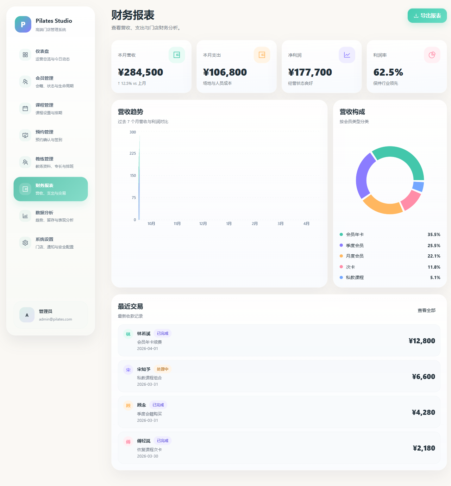
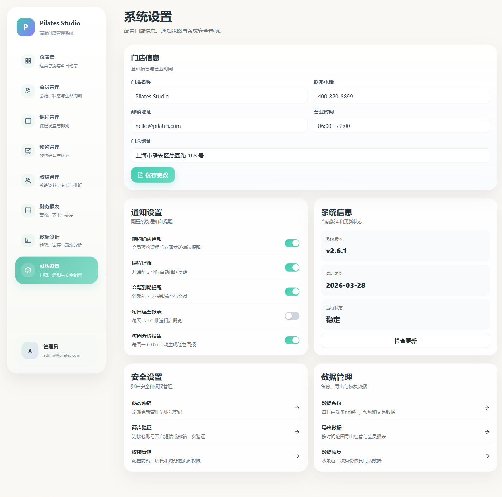

# Pilates Studio Admin

一个基于 **React 18 + Umi 4 + Ant Design 5 + TypeScript + Recharts + CSS Modules** 构建的高保真 Pilates Studio SaaS 管理后台前端项目。

本项目根据一组 Pilates Studio 后台截图从 0 搭建，包含完整布局、8 个核心业务页面、统一设计系统、Mock 数据和可运行演示，适合作为管理后台展示项目、UI 还原练习项目和企业级中后台前端模板。

## 在线预览说明

当前仓库为前端演示版本，数据由本地 Mock 提供。克隆后可直接运行查看完整后台效果。

## 当前迭代增强

- 已补齐登录页、忘记密码页、403 页、404 页
- 已支持角色权限页与预览身份切换
- 已补齐 Dashboard 内部 drill-down 子页面
- 已补充关键空状态、移动端适配与账户区交互优化

## 项目预览

### 仪表盘



### 会员管理



### 财务报表



### 系统设置



## 页面列表

1. 仪表盘
2. 会员管理
3. 课程管理
4. 预约管理
5. 教练管理
6. 财务报表
7. 数据分析
8. 系统设置
9. 角色权限
10. 登录页 / 忘记密码 / 403 / 404

## 页面说明

### 1. 仪表盘
- 经营数据总览
- 今日课程 / 今日预约
- 教练排班
- 会员增长趋势

### 2. 会员管理
- 会员列表
- 会籍状态
- 联系方式与剩余课时
- 搜索 / 筛选 / 导出

### 3. 课程管理
- 课程卡片视图
- 课程类型与难度标签
- 教练 / 时长 / 容量指标
- 排期时间展示

### 4. 预约管理
- 预约列表卡片
- 时间筛选分段器
- 状态标签
- 签到 / 确认 / 详情操作

### 5. 教练管理
- 教练信息卡片
- 专长领域 / 资质认证
- 指标块展示
- 编辑资料 / 排班管理

### 6. 财务报表
- 收支 KPI 卡片
- 营收趋势柱状图
- 营收构成环图
- 最近交易列表

### 7. 数据分析
- 课程热度分析
- 综合评分雷达图
- 时段分布与留存趋势
- 高峰时段指标卡

### 8. 系统设置
- 门店信息表单
- 通知开关
- 系统信息
- 安全设置 / 数据管理

### 9. 角色权限
- 角色卡片管理
- 权限矩阵开关
- 角色详情 / 编辑 / 删除
- owner 角色访问控制

### 10. 辅助页面
- 登录页
- 忘记密码页（预览版）
- 403 无权限页
- 404 页面不存在页

## 设计特点

- 风格方向：高级、简洁、企业级 SaaS 后台
- 主色：薄荷绿 / 青绿色
- 辅助色：紫色 / 橙色 / 粉色 / 蓝色
- 布局：固定侧边导航 + 顶部标题说明 + 卡片化内容区
- 视觉特点：大圆角、轻阴影、暖白背景、柔和高亮、统一状态标签与按钮体系
- 图表统一：全部基于 Recharts 实现
- 样式方案：CSS Modules + 全局设计 Token

## 技术栈

- React 18
- Umi 4
- Ant Design 5
- TypeScript
- Recharts
- CSS Modules

## 目录结构

```text
src/
  layouts/
  pages/
    dashboard/
    members/
    courses/
    bookings/
    coaches/
    finance/
    analytics/
    settings/
  components/
  styles/
  utils/
  mock/
docs/
  screenshots/
```

## 本地运行

> Windows PowerShell 下建议使用 `npm.cmd`

```powershell
cd C:\Users\MrDing\pilates-studio-admin
npm.cmd install
npm.cmd run dev
```

默认访问地址：

- http://localhost:8000

## 常用命令

```powershell
npm.cmd run dev
npm.cmd run typecheck
npm.cmd run build
```

## 当前状态

- 已完成完整前端搭建
- 已完成多轮高保真视觉微调
- 已通过类型检查与生产构建
- 已支持 README 页面预览图展示
- 已支持 demo 权限体验与 dashboard drill-down 结构

## 适用场景

- 前端作品集展示
- SaaS 后台 UI 还原练习
- 企业管理后台原型项目
- 后续接入真实 API 的前端基础模板

## 说明

本项目当前为前端演示版本，数据由本地 Mock 提供，便于后续快速接入真实 API、鉴权、上传、报表等真实业务能力。
