# 普拉提门店后台管理端操作说明书

## 1. 文档目的

本文档用于指导门店管理员、店长、前台和运营人员使用后台管理端完成日常业务操作，包括会员管理、课程管理、排课、预约处理、通知管理和门店设置等工作。

## 2. 适用对象

- 超级管理员
- 店长
- 前台运营人员
- 教练管理人员
- 财务或数据查看人员

不同角色可见页面和可执行操作可能不同，请以实际账号权限为准。

## 3. 登录后台

后台登录地址由门店统一提供。进入登录页后，输入：

- 邮箱账号
- 登录密码

登录成功后进入管理后台首页。

如忘记密码，可在登录页进入“忘记密码”页面，按提示提交找回申请，再联系管理员处理重置。

### 页面示意

登录页示意：

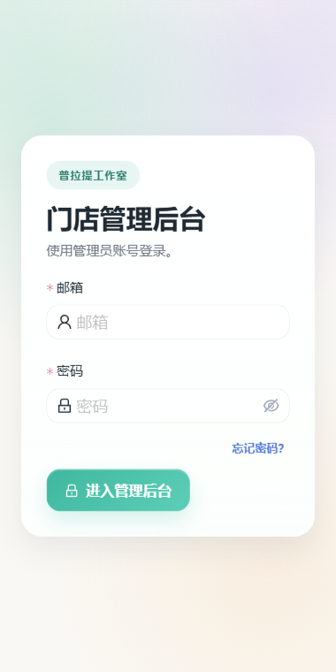

## 4. 首页总览

后台首页用于查看当前门店经营概况，通常包括：

- 今日预约
- 本周预约
- 待处理事项
- 最近课程安排
- 通知提醒
- 运营概览

建议管理员每天先查看首页，再进入具体模块处理业务。

首页总览示意：

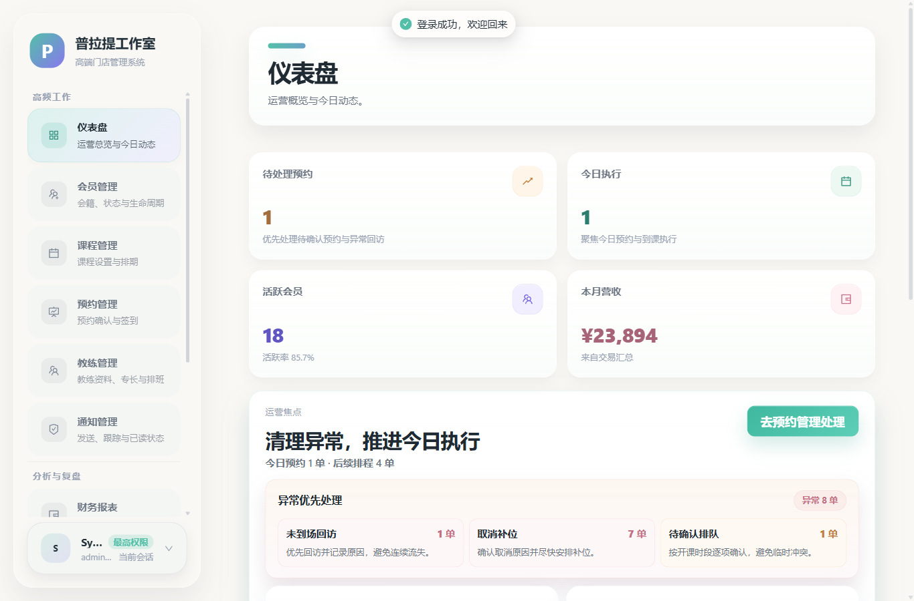

## 5. 会员管理

会员管理用于维护门店会员档案。

### 5.1 主要功能

- 查看会员列表
- 搜索会员
- 新增会员
- 编辑会员资料
- 查看会员详情
- 查看会员近期记录

### 5.2 常见操作

#### 新增会员

适用于线下新签约或首次建档的会员。填写会员基础资料后保存。

#### 编辑会员

可更新会员姓名、联系方式、会员状态及相关档案信息。

#### 查询会员

可按姓名、手机号或其他业务字段快速检索。

### 5.3 使用建议

- 新增会员前先搜索，避免重复建档
- 修改手机号等关键信息前，先与会员本人确认
- 会籍即将到期的会员建议及时跟进续费

会员管理页示意：

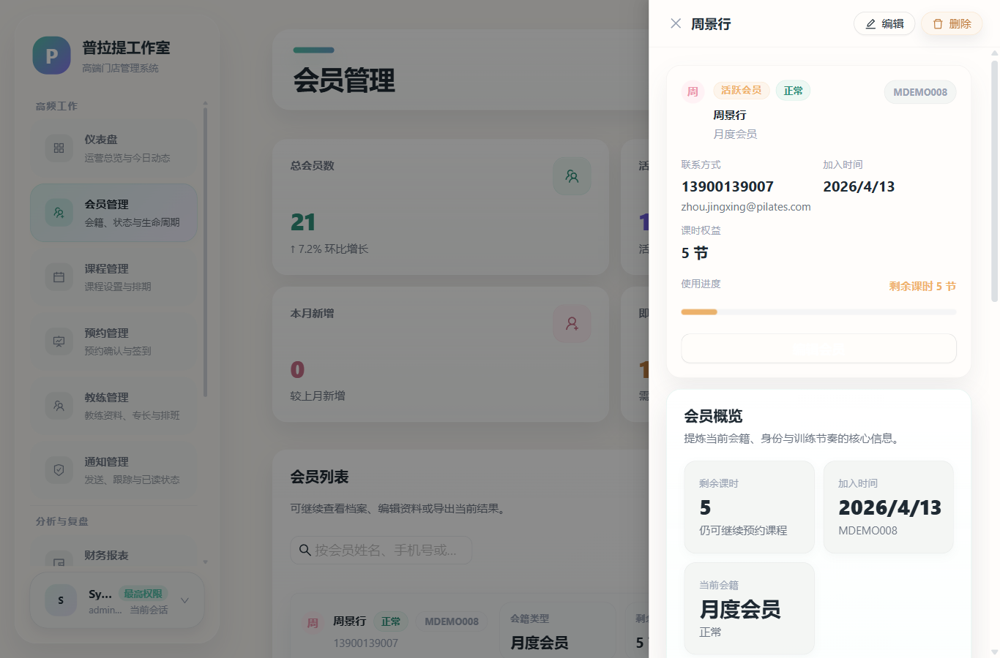

## 6. 小程序用户管理

该模块用于查看小程序账号与会员档案的绑定情况。

### 6.1 主要功能

- 查看小程序用户列表
- 搜索昵称、OpenID、手机号或会员信息
- 绑定或重新绑定会员
- 查看账号状态

### 6.2 适用场景

- 用户已登录小程序，但看不到完整会员信息
- 需要将某个小程序账号绑定到正确会员档案
- 排查账号异常或停用状态

小程序用户管理页示意：

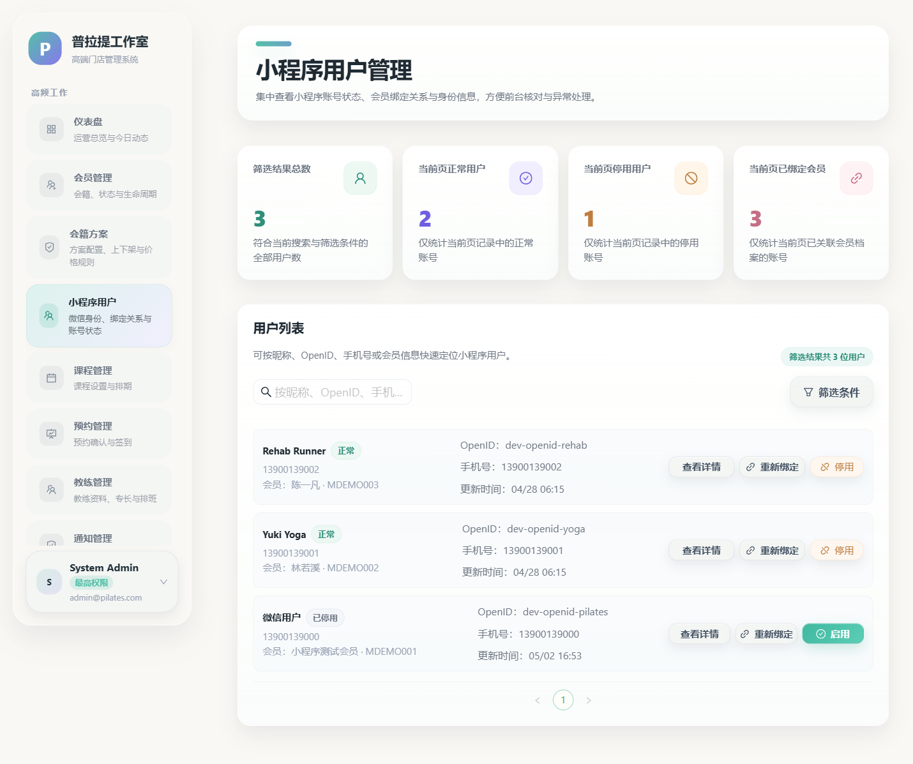

## 7. 会员方案管理

会员方案管理用于配置门店可售卖的会员卡或课包方案。

### 7.1 可管理内容

- 方案名称
- 方案类型
- 标价
- 有效期
- 总课时
- 启用状态

### 7.2 常见场景

- 新增季卡、月卡、私教包等方案
- 调整方案价格或有效期
- 停用旧方案，避免继续售卖

### 7.3 注意事项

- 修改已在售方案时，建议确认是否影响现有会员
- 停用方案前，先确认前台是否仍在推广或售卖

会员方案页示意：

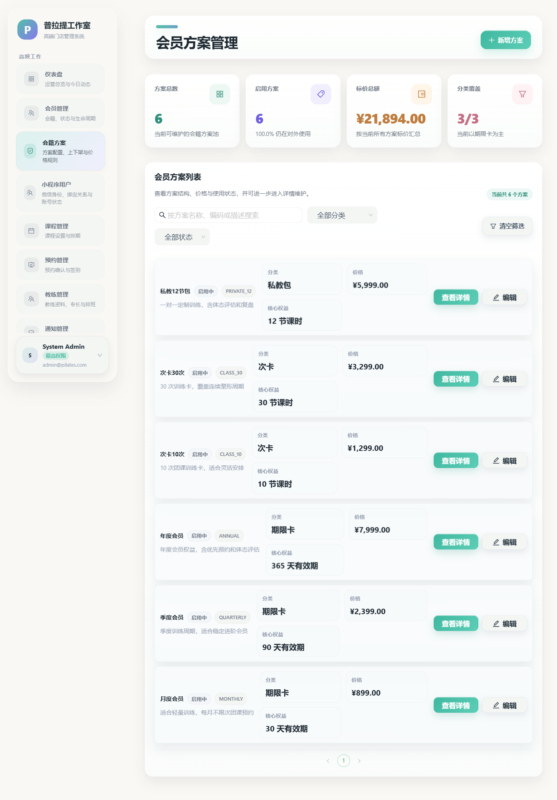

## 8. 课程管理

课程管理用于维护课程基础资料。

### 8.1 主要功能

- 新增课程
- 编辑课程
- 上下架课程
- 上传课程封面
- 维护课程类型、难度、简介和默认教练

### 8.2 课程封面上传

后台支持上传课程图片，保存成功后，小程序课程页会同步使用对应封面图。

上传时建议：

- 使用清晰横版图片
- 控制图片大小，避免过大
- 保存后再到小程序检查显示效果

### 8.3 注意事项

- 删除或停用课程前，应先确认是否已排课
- 如课程已有预约用户，更应先评估影响再执行删除或停用

课程管理页示意：

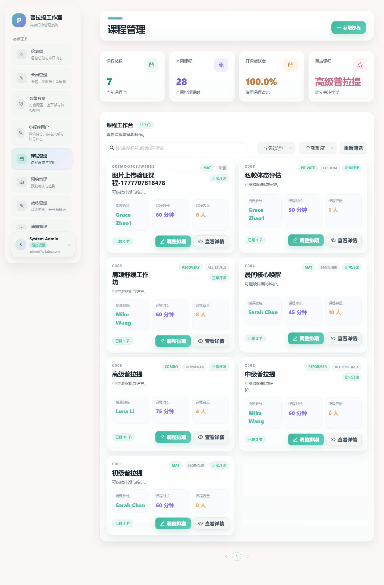

## 9. 教练管理

教练管理用于维护教练资料。

### 9.1 主要功能

- 新增教练
- 编辑教练信息
- 上传教练照片
- 维护教练简介、专长和状态

### 9.2 使用建议

- 教练资料尽量完整，便于小程序展示
- 上传教练照片后，建议同步查看小程序页面效果

教练管理页示意：

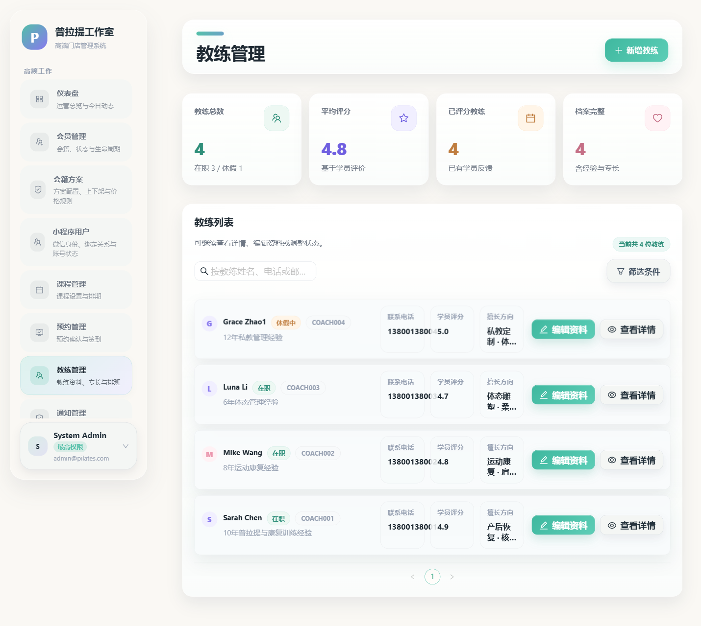

## 10. 排课管理

排课管理用于维护实际可预约的课节。

### 10.1 可配置内容

- 所属课程
- 授课教练
- 开始时间
- 结束时间
- 容量人数
- 上课地点
- 是否开放预约

### 10.2 常见操作

#### 新建课节

创建后可在小程序预约页展示。

#### 修改课节

可调整时间、教练、容量和开放状态。

#### 暂停展示

适用于临时不开放预约但暂不删除的情况。

#### 删除课节

删除前请先确认是否已有预约记录，避免影响用户。

### 10.3 使用建议

- 调整时间前先确认是否已有会员预约
- 地点字段建议填写完整，便于门店内部识别
- 改动课节后建议同步核对小程序展示

## 11. 预约管理

预约管理是门店日常使用频率最高的模块之一。

### 11.1 主要功能

- 查看预约列表
- 按日期、会员、课程、预约编号筛选
- 查看预约详情
- 新增预约
- 更新预约状态

### 11.2 常见状态

- 待确认
- 已确认
- 已完成
- 已取消

### 11.3 常见操作

#### 创建预约

后台可直接为会员创建预约，适用于电话预约、到店预约等场景。

#### 确认预约

用于将待处理预约更新为可正常上课状态。

#### 取消预约

如需取消，请确认是否符合门店规则，并同步通知会员。

### 11.4 使用建议

- 高峰期建议优先处理待确认预约
- 修改预约状态前，确认会员、课节和时间信息无误
- 对异常预约保留备注或线下沟通记录

预约管理页示意：

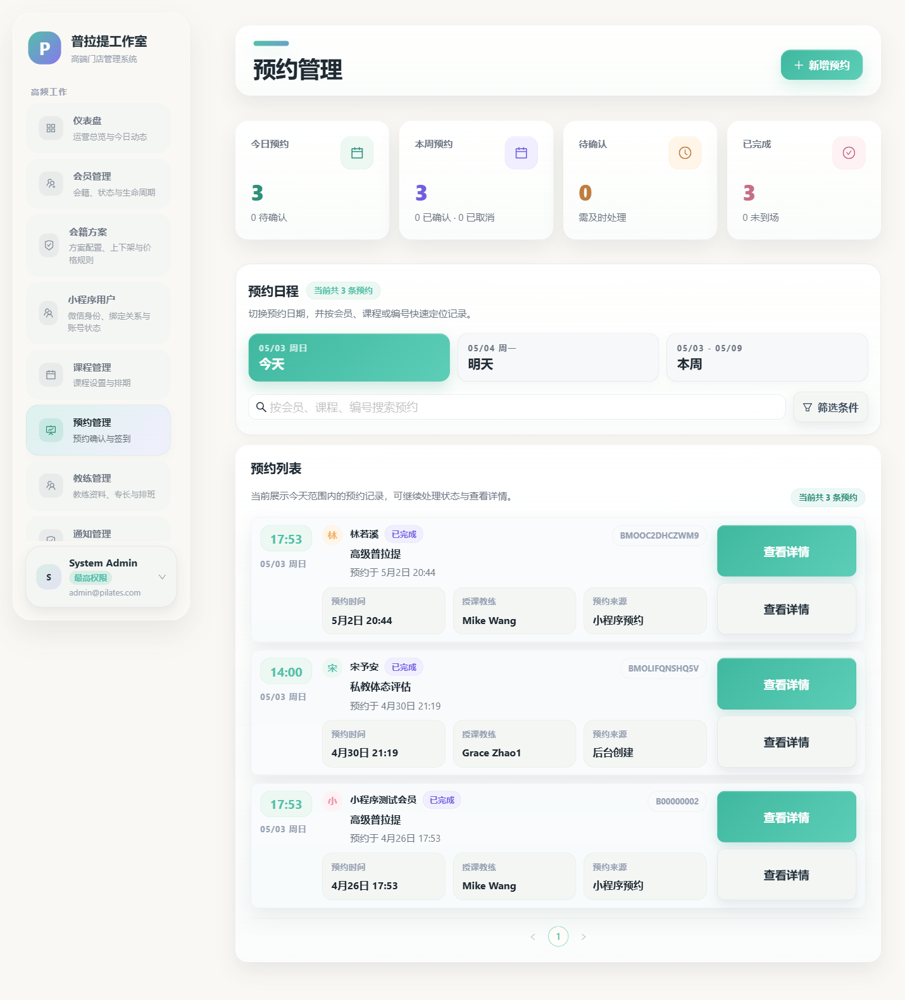

## 12. 出勤与签到

出勤模块用于处理到店签到和课后完成记录。

### 12.1 主要功能

- 查看待签到预约
- 执行签到
- 标记课程完成
- 查看出勤记录

### 12.2 操作建议

- 上课前完成签到核销
- 课后及时标记完成，保证训练记录和扣次数据同步

## 13. 训练记录

训练记录用于沉淀已完成课程的历史数据。

可用于：

- 查看会员历史训练情况
- 辅助教练制定后续训练计划
- 作为门店服务跟进依据

## 14. 通知管理

通知管理用于配置或发送门店通知，并查看投递情况。

### 14.1 常见通知类型

- 系统通知
- 门店通知
- 预约确认
- 预约取消
- 课程提醒
- 签到成功
- 会籍到期
- 续费申请
- 小程序反馈
- 账号注销申请

### 14.2 使用建议

- 文案尽量简洁明确
- 与预约、续费相关的通知要注意时间准确
- 如发现投递失败，及时检查对应配置

通知管理页示意：

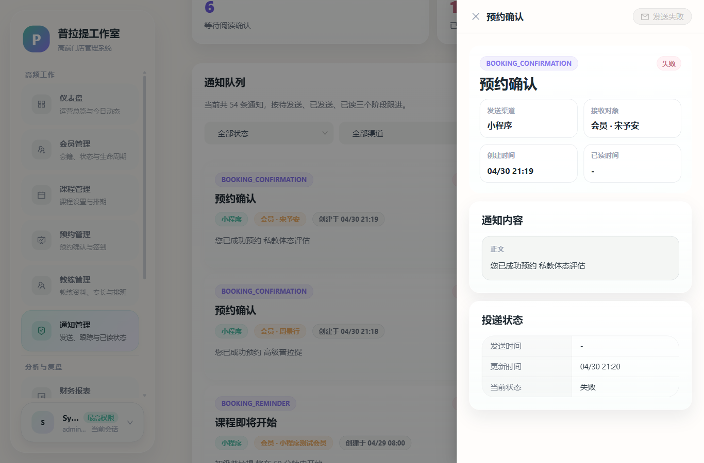

## 15. 知识库管理

知识库内容会同步到小程序帮助页。

### 15.1 主要功能

- 新增知识条目
- 编辑知识条目
- 设置分类
- 上下架条目
- 删除不再使用的内容

### 15.2 推荐内容

- 预约规则
- 会员服务说明
- 账号问题解答
- 通用门店说明

## 16. 财务与分析

### 16.1 财务模块

用于查看交易与营收数据，支持：

- 查看交易记录
- 筛选交易类型和状态
- 导出报表

### 16.2 分析模块

用于查看门店经营趋势，常见内容包括：

- 预约热度
- 会员留存
- 交易趋势
- 营收目标达成率

### 16.3 使用建议

- 月度复盘建议导出报表留档
- 结合预约和会员数据综合判断经营状态

财务页示意：

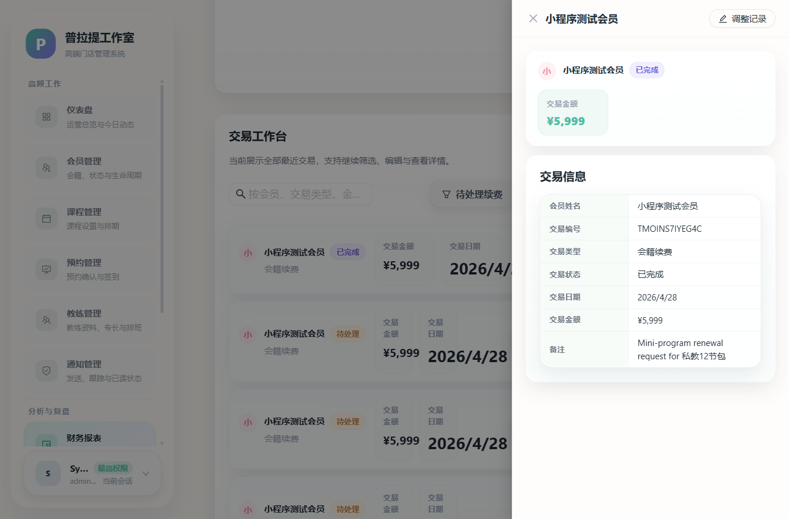

分析页示意：

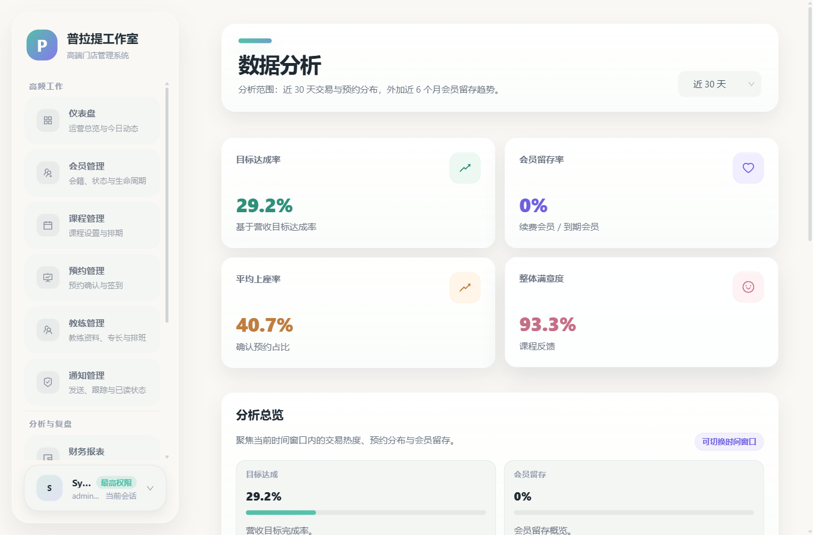

## 17. 管理员与角色权限

### 17.1 管理员账号

可用于：

- 新增管理员
- 编辑管理员信息
- 调整角色
- 重置或修改密码

### 17.2 角色权限

可根据岗位配置权限，例如：

- 会员管理
- 预约管理
- 课程管理
- 教练管理
- 系统设置
- 导出权限

### 17.3 建议

- 前台、店长、财务使用不同角色
- 非必要不要授予过高权限
- 定期清理离职或停用账号

角色权限页示意：

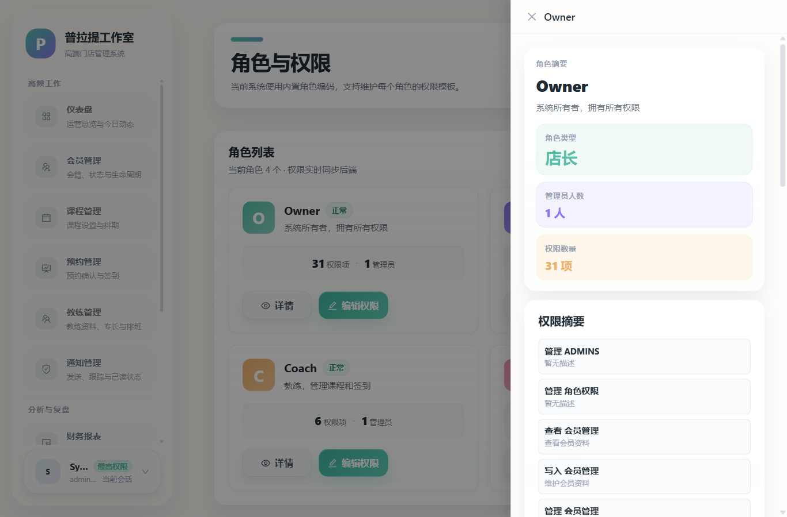

## 18. 系统设置

系统设置用于维护门店基础信息和部分运行配置。

### 18.1 门店信息

可维护内容通常包括：

- 门店名称
- 门店地址
- 门店图片
- 联系方式
- 其他基础展示信息

### 18.2 地址维护说明

后台支持按门店地址自动解析地图坐标，用于小程序导航。维护地址时建议：

- 填写完整地址
- 包含省、市、区、路名、门牌号或楼栋信息
- 保存后用小程序首页导航进行验证

### 18.3 图片维护

门店图片上传成功后，小程序首页和相关展示位会同步读取新图片。

系统设置页示意：

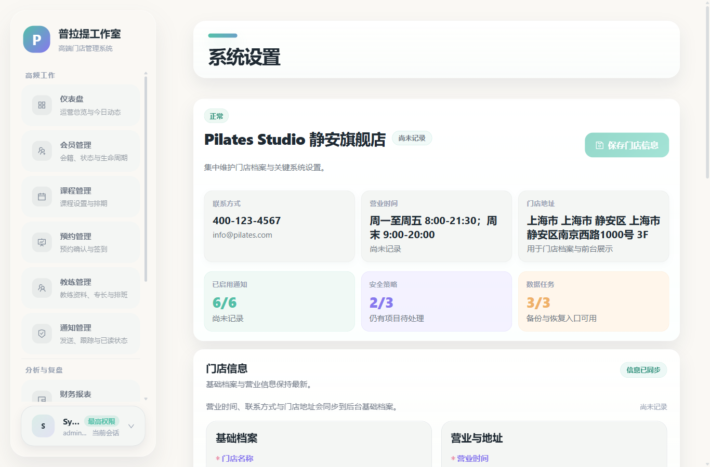

## 19. 数据导出、备份与恢复

系统设置中通常提供：

- 导出备份
- 导出数据
- 数据恢复

### 19.1 建议做法

- 重要变更前先做备份
- 月度或活动期前后可导出关键报表
- 恢复数据前先确认恢复范围与影响

## 20. 日常操作建议

建议按照以下顺序处理日常业务：

1. 登录后先看首页待处理事项
2. 处理预约和签到
3. 核对当天课程与排课
4. 跟进会员续费、反馈和通知
5. 维护门店信息、课程封面和教练资料

## 21. 常见问题

### 21.1 为什么某个页面看不到？

通常是当前账号权限不足，请联系超级管理员分配对应角色权限。

### 21.2 为什么小程序看不到新课程或新图片？

请检查：

- 课程是否已保存
- 课节是否已开放预约
- 图片是否上传成功
- 小程序端是否已刷新

### 21.3 修改门店地址后为什么导航不准确？

请确认地址是否填写完整，保存后再到小程序首页点击导航验证。

### 21.4 上传图片失败怎么办？

优先检查：

- 图片格式是否正确
- 图片大小是否超限
- 后端文件服务是否正常

## 22. 结束语

后台管理端是门店运营核心工具。建议门店在正式使用前，对前台、店长和管理员分别进行一次角色化培训，并结合本门店规则补充内部操作规范。
